---
# Title, summary, and page position.
linktitle: Sesión 03
weight: 1
icon: book
icon_pack: fas

# Page metadata.
title: Visualizaciones con Matplotlib
type: book  # Do not modify.
---

El primer paso es cargar ('importar') la libreria


```python
import matplotlib.pyplot as plt
```

Aquí estamos introduciendo el modulo pyplot dentro de la librería *matplotlib* y estamos renombrandola a *plt* para facilitar las llamadas a sus funciones.

El módulo lo podeis encontrar 

 - Tanto aquí: pyplot   [GitHub](https://github.com/matplotlib/matplotlib/blob/master/lib/matplotlib/pyplot.py)

 - Como en el directorio local (en vuestro ordenador) de librerias de anaconda, de las cuales estamos importandolo.

    
En el mismo script (fichero .py) de *matplotlib.pyplot* encontramos la siguiente definición a modo de comentario

---
  
    "`matplotlib.pyplot` is a state-based interface to matplotlib. It provides
    a MATLAB-like way of plotting."
    
---

[¿Qué significa **state-based interface**?](https://stackoverflow.com/questions/52816131/matplotlib-pyplot-documentation-says-it-is-state-based-interface-to-matplotlib)

     Básicamente que los comandos crean una figura y unos ejes, cuyo estado es actualizado/modificado/ajustado
     secuencialmente mediante llamadas a funciones.

Añadimos numpy para facilitar las operaciones


```python
import numpy as np
```

## Primer gráfico


```python
# Creando visualizaciones con Matplotlib 
#              X               Y
plt.plot(list(range(100)), list(range(0,300,3)))
plt.show() # Esto muestra el gráfico
```


    
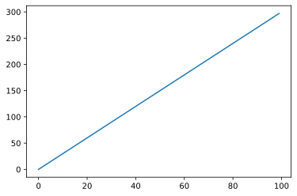
    


## Segundo gráfico


```python
# Datos
X = np.array([1.1, 1.3, 1.5, 1.7, 1.9, 2.1, 2.3])
Y1 = np.array([21.8, 21.4, 20.7, 20.5, 20.4, 19.9, 18.6])
# Creando visualizaciones con Matplotlib 
#              X               Y
plt.plot(X,Y1)
plt.show() # Esto muestra el gráfico
```


    
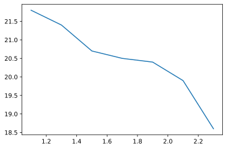
    


**Algunos detalles...**


```python
# Creamos una figura y establecemos medidas del gráfico
plt.figure(figsize=(10,4))

# Establecemos el título
plt.title('Primer gráfico con Python', fontsize=15, pad=10) # tamaño de fuente, margen con la caja de gráfico

# Creamos dos listas y las convertimos a numpy.ndarray
X = np.array([1.1, 1.3, 1.5, 1.7, 1.9, 2.1, 2.3])
Y1 = np.array([21.8, 21.4, 20.7, 20.5, 20.4, 19.9, 18.6])
# > Creamos la segunda curva a partir de la primera
np.random.seed(1)
Y2 = Y1 + np.random.random_sample(size=Y1.shape[0])

# Dibujamos dos curvas
plt.plot(X,Y1, color = 'blue', label='Linea azul', marker='s', markersize=10, alpha=0.7, zorder=1)
plt.plot(X,Y2, color = 'red',  label='Linea roja', marker='.', markersize=13, alpha=0.7, zorder=1)

# Añadimos descripción a ejes
plt.xlabel('Tamaño (u.)')
plt.ylabel('Extracción percentual (masa %)')
# Añade la leyenda
plt.legend(loc ='lower center')
plt.show()
```


    
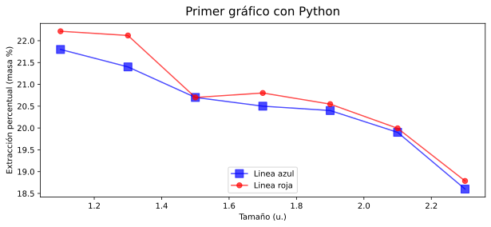
    


## Por suerte... no hay que saberlo todo 

[MATPLOTLIB](https://matplotlib.org/index.html)

En este link tenemos ejemplos muy útiles que nos pueden

- **Ayudar a encontrar esa linea de código que buscamos**
- **Inspirarnos para visualizar datos con los que estamos trabajando**


```python
from IPython.display import IFrame # De esta librería se originó Jupyter Notebooks  
# (https://en.wikipedia.org/wiki/Project_Jupyter)
url = 'https://www.matplotlib.org'
IFrame(url, width=950, height=300)
```


<iframe
    width="950"
    height="300"
    src="https://www.matplotlib.org"
    frameborder="0"
    allowfullscreen
></iframe>


## Tipos de gráficos
---

- Linea, scatterplot 

- Barras (vertical, horizontal)
   - Stacked 
  
   - Grouped
   
- Broken bar
- Histograma
- Pie, Donut
- Heatmaps
- ...

---

**Además esta el juego de las coordenadas**

- Cilíndricas, esféricas, etc...

**Además podemos hacer gráficos mútiples con combinaciones de las anteriores**

- 3 gráficos independientes en 1: Scatterplot, barras y pie


[Ejemplos en matplotlib](https://matplotlib.org/tutorials/introductory/sample_plots.html)

### Barras
---
- vertical / [horizontal](https://matplotlib.org/api/_as_gen/matplotlib.pyplot.barh.html?highlight=barh#matplotlib.pyplot.barh)
   - [Stacked](https://matplotlib.org/api/_as_gen/matplotlib.pyplot.bar.html?highlight=bar#matplotlib.pyplot.bar)
  
   - [Grouped](https://matplotlib.org/gallery/lines_bars_and_markers/barchart.html#sphx-glr-gallery-lines-bars-and-markers-barchart-py)(usando ejes, lo veremos más adelante en este notebook)

Creamos unos datos a mano...


```python
# Datos
# > Nombre de salas
salas_de_cine_list = ['Sala 1', 'Sala 2', 'Sala 3', 'Sala 4', 'Sala 5']
# > Listas con valores enteros como datos para graficar
ocupacion_media_invierno = [20, 35, 30, 35, 27]
ocupacion_media_verano = [25, 32, 34, 20, 25]
invierno_std = [2, 3, 4, 1, 2]
verano_std = [3, 5, 2, 3, 3]

# Parámetros
# > Anchura de barras que mostraremos
width = 0.35
```

Y hacemos un gráfico de barras...


```python
# Gráfico de barras para ocupación

# Llamada a la funcion 'bar' del módulo pyplot
#            X                         Y             anchura,    error,           etiqueta para leyenda,   color
plt.bar(salas_de_cine_list , ocupacion_media_invierno, width, yerr=invierno_std, label='Invierno', color='blue')
#            X                         Y             anchura,    error,      origen vertical de las barras 
plt.bar(salas_de_cine_list , ocupacion_media_verano, width, yerr=verano_std, bottom=np.array(ocupacion_media_invierno),
#        etiqueta para leyenda,   color
       label='Verano',            color='red')

# Ajustes del gráfico
# > Título
plt.title('Ocupación salas de cine', fontsize=17)
# > Leyenda de ejes horizontal y vertical
plt.xlabel('Salas de cine', fontsize=12)
plt.ylabel('Ocupación percentual (%)', fontsize=12)

# > Leyenda de valores mostrados
plt.legend(loc=1, ncol=2)
#  Aquí 'loc' determina la posición de la leyenda y 
#       'ncol' determina cuantas columnas tendrá ( en este caso 2 columnas para dos elementos = 1 fila)


# Mostrar gráfico
plt.show()
```


    
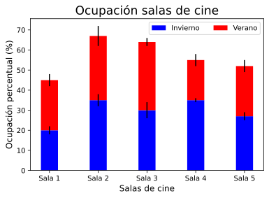
    


---

¿Qué pasa si variamos **loc** en la leyenda de 1 a 9? ¿Y si ponemos por ejemplo 'lower center'?

Los valores que acepta **loc** son los siguientes:


<table class="docutils" border="1" style="margin-right:auto;margin-left:0px">
<colgroup>
<col width="54%">
<col width="46%">
</colgroup>
<thead valign="bottom">
<tr class="row-odd"><th class="head">Location String</th>
<th class="head">Location Code</th>
</tr>
</thead>
<tbody valign="top">
<tr class="row-even"><td>'best'</td>
<td>0</td>
</tr>
<tr class="row-odd"><td>'upper right'</td>
<td>1</td>
</tr>
<tr class="row-even"><td>'upper left'</td>
<td>2</td>
</tr>
<tr class="row-odd"><td>'lower left'</td>
<td>3</td>
</tr>
<tr class="row-even"><td>'lower right'</td>
<td>4</td>
</tr>
<tr class="row-odd"><td>'right'</td>
<td>5</td>
</tr>
<tr class="row-even"><td>'center left'</td>
<td>6</td>
</tr>
<tr class="row-odd"><td>'center right'</td>
<td>7</td>
</tr>
<tr class="row-even"><td>'lower center'</td>
<td>8</td>
</tr>
<tr class="row-odd"><td>'upper center'</td>
<td>9</td>
</tr>
<tr class="row-even"><td>'center'</td>
<td>10</td>
</tr>
</tbody>
</table>


[[Referencia](https://matplotlib.org/3.1.0/api/_as_gen/matplotlib.pyplot.legend.html)]

---


Hacemos una variación en las que las barras que hacen referenica a los datos de verano irán hacia abajo...


```python
# Gráfico de barras para ocupación

# Llamada a la funcion 'bar' del módulo pyplot
#            X                         Y             anchura,    error,  etiqueta para leyenda,   color
plt.bar(salas_de_cine_list , ocupacion_media_invierno, width, yerr=invierno_std, label='Invierno', color='blue')
#            X                         Y                          anchura,    error,    etiqueta para leyenda,   color       
plt.bar(salas_de_cine_list , -np.array(ocupacion_media_verano), width, yerr=verano_std, label='Verano', color='red')

# Anotación
plt.annotate('Extreno de Harry Potter', xy=(2.2, -50), xytext=(2.5, -50),
            arrowprops=dict(arrowstyle = "-"), va='center')

plt.title('Ocupación salas de cine', fontsize=17)
plt.xlabel('Salas de cine', fontsize=12)
plt.ylabel('Ocupación percentual (%)', fontsize=12)

# Cambiar valores negativos a positivos
# > Obtenemos las posiciones y los valores marcados en el eje de ordenadas, Y.
loc, labels = plt.yticks() 
# > Cambiamos los valores haciendo el absoluto
plt.yticks(loc, np.absolute(np.array(loc)))

# Incluimos la leyenda, que mostrará los 'label' introducidos previamente con 'plt.bar'
plt.legend(loc=8,        # Posición dado en tipo 'int', también admite 'str' como 'lower center'
           ncol=2,       # número de columnas en las que muestra los labels
           framealpha=0) # transparencia del recuadro, de 0 a 1 siendo 0 transparente y 1 opaco


# Mostramos el gráfico
plt.show()
```


    
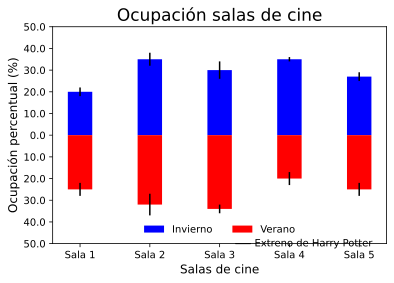
    


Hacemos otra variante que muestre los datos de ambos periodos agrupados...


```python
# El número de periodos es dos (invierno, verano)
n_barras = 2
# Mostramos de tal forma que la barra de invierno aparezca desplazada a la izquierda (X + width/2)
#                            la barra de verano   aparezca desplazada a la derecha   (X + width/2)
plt.bar(np.arange(len(salas_de_cine_list)) - width/n_barras , ocupacion_media_invierno, width, yerr=invierno_std, label='Invierno', color='blue')
plt.bar(np.arange(len(salas_de_cine_list)) + width/n_barras , ocupacion_media_verano,   width, yerr=verano_std,   label='Verano', color='red')

# Ajustes de gráfico
# > Título
plt.title('Ocupación salas de cine', fontsize=17)
# > Etiqueta de ejes
plt.xlabel('Salas de cine', fontsize=12)

# > Reasignamos los marcadores del eje horizontal
plt.xticks(range(len(salas_de_cine_list)), salas_de_cine_list)
plt.ylabel('Ocupación percentual (%)', fontsize=12)

# > Añadimos la leyenda
plt.legend(loc='lower center', ncol=2)
plt.show()
```


    
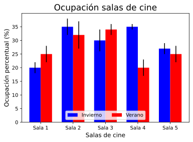
    


### Pie y Donut
---

 


```python
# Datos
# > Dias
trimestres_list = ['Ene-Mar', 'Abr-Jun', 'Jul-Sep', 'Oct-Dic']
# > Taquilla por trimestres
taquilla_por_trimestre = [2500, 3500, 3500, 1000]

```


```python
# Parámetros
# > Separación del centro - introduciomos pequeño margen en todas las 'porciones'
explode = np.repeat(0.01,4) # 
# > Colores aleatorios pero definidos por la semilla
np.random.seed(2)
colores = np.random.random_sample(size=(4,3))


# GRÁFICO

plt.pie(taquilla_por_trimestre, #         valores numéricos,
        explode=explode, #                margenes de quesitos en orden,
        labels=trimestres_list,  #        etiqueta de referencia de cada valor
        shadow=False, #                   sombra
        startangle=45,  #                 angulo de referencia para el primer queso
        colors=colores) #                 colores para cada quesito

# > Ajuste de gráfico
# Título
plt.title('Taquilla (%) 2019', fontsize=14, weight='bold')


# Mostramos la imagen
plt.show()
```


    
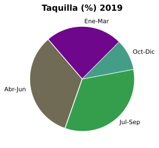
    


--- 
**Cambiamos y añadimos**:

- El sentido de los valores (trimestres)

- Añadimos formato donut

- Escribimos la taquilla total en euros en medio del donut


```python
# Ajustes gráficos
# > Separación del centro - introduciomos pequeño margen en todas las 'porciones'
explode = np.repeat(0.01,4) # 

# > Colores aleatorios pero definidos por la semilla
np.random.seed(2)
colores = np.random.random_sample(size=(4,3))

# Ploteamos
plt.pie(taquilla_por_trimestre, #         valores numéricos,  
        explode=explode, #                margenes de quesitos en orden, 
        labels=trimestres_list,  #        etiqueta de referencia de cada valor
        shadow=False, #                   sombra
        startangle=-180,  #               angulo de referencia para el primer queso
        colors=colores, #                 colores para cada rosquito
        wedgeprops=dict(width=0.4),#      anchura radial de los roscos en fracción (1 Pie, 0 Nada)   
        counterclock=False)

# Ajustes
# > Título
plt.title('Taquilla (%) 2019', fontsize=14, weight='bold')
# > Añadimos texto
plt.text(0,0,s=f'{sum(taquilla_por_trimestre)} €', ha='center', fontsize=10, weight='bold')

# > Mostramos la imagen
plt.show()
```


    
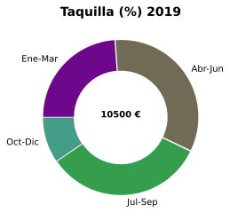
    


¿Qué te parecen estos gráficos? ¿Crees que comunican bien la información?

Consejos para el uso de este tipo de gráficos [aquí](https://depictdatastudio.com/when-pie-charts-are-okay-seriously-guidelines-for-using-pie-and-donut-charts/).

¿Qué ves ahora que no sea del todo 'correcto'? 

---
### Heatmap


 


```python
# Generamos datos aleatorios
np.random.seed(1) # Estableciendo semilla para replicabilidad
matriz_de_datos = np.random.random_sample(size=(10,10))
```


```python
# GRÁFICO
# usamos la función imshow
plt.imshow(matriz_de_datos, vmax=1, vmin=0, cmap='viridis')


# Ajustes
# > Título
plt.title('Heatmap', fontsize=20, pad=10)
# > Etiquetas
plt.xlabel('Columnas', fontsize=15)
plt.ylabel('Filas', fontsize=15)
# > marcadores en ejes
plt.xticks(np.array(range(10)), np.array(range(10))+1)
plt.yticks(np.array(range(10)), [chr(97+ii).upper() for ii in range(10)])
# > Ajustamos el rango vertical, puesto que se ve modificado por el cambio anterior
plt.ylim(9.5,-0.5)

# Barra de referencia de color y valores
plt.colorbar()

# Escribimos valor de una posición 
plt.text(0,0,s=str(round(matriz_de_datos[0,0],1)), fontsize=8, ha='center', color='white', weight='bold')

# Escribir todos los valores
#   ¿Cómo lo harías?


# mostrarlo
plt.show()
```


    
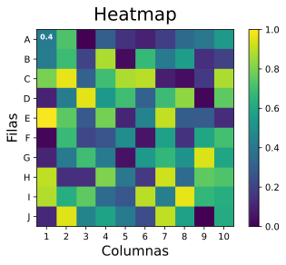
    


 - **¿Cómo mostrarías todos los valores numéricos en sus casillas correspondientes?** [Un ejemplo algo más complejo de esto](https://matplotlib.org/3.1.1/gallery/images_contours_and_fields/image_annotated_heatmap.html?highlight=heatmap)
 
 
 - **¿Cómo harías para mostrar los valores mayores que 0.5 en negro y los valores menores o iguales a 0.5 en blanco?**

Piensa en el ejemplo del cine Golem de la alhondiga de Bilbo...

Podríamos visualizar la ocupación media de cada asiento para un periodo de tiempo dado.


## Multiples gráficos (subplots)

- Utilizamos *plt.subplots* [[Documentación](https://matplotlib.org/3.1.1/api/_as_gen/matplotlib.pyplot.subplots.html#matplotlib.pyplot.subplots)]


```python
# -----------------------------------------------------------------------------
# Objetivo
#                 Hacer una figura de 3x3 gráficos usando subplots
# -----------------------------------------------------------------------------

# > Creamos los puntos del eje de abscisa
X=np.linspace(-10,10,1000)

# > Creación de datos para el eje de ordenada (9 listas, una para cada subplot, y cada una de 100 elementos como X)
# >> Usamos diccionarios
data_dict = {}
# >> Creamos los puntos del eje de ordenadas mediante ecuaciones del coseno.
#     Para esto hacemos dos bucles anidados, de tres cada uno para obtener 9 valores.
for ii in range(3):
    for jj in range(3):
        # Añadimos el key tupla ii,jj y su valor, un diccionario a su vez
        data_dict[ii, jj] = {'data':  X*np.cos((ii-jj+1)*X)*np.cos((ii+jj+1)*X), # Añadimos datos,  
                             'text': fr'$x\cdot\cos({ii-jj+1}x)\cdot\cos({ii+jj+1}x)$' } 
                                       # ecuación en formato text usando notación de LaTeX
                                       # (usamos f para formato y r para formato LaTeX)
```


```python
# GRÁFICO
# > Creamos la figura y los ejes
#                     (nfilas, ncolumnas, tamaño, ejes compartidos X)
fig, ax = plt.subplots(3,3, figsize=(15,5), sharex = True) # Sharex comparte el eje X

# Imprimimos el tipo de cada objeto, para saber con que estamos trabajando
print(type(fig), type(ax)) 
# Esto nos da '<class 'matplotlib.figure.Figure'> <class 'numpy.ndarray'>'

# Ploteamos cada par X, data_dict[ii, jj]['data']
for ii in range(3):
    for jj in range(3):
        ax[ii, jj].plot(X,data_dict[ii,jj]['data'])
        ax[ii, jj].set_title(data_dict[ii, jj]['text'])

plt.suptitle('Multiples gráficos', fontsize=15)
plt.show()
```

    <class 'matplotlib.figure.Figure'> <class 'numpy.ndarray'>
    


    
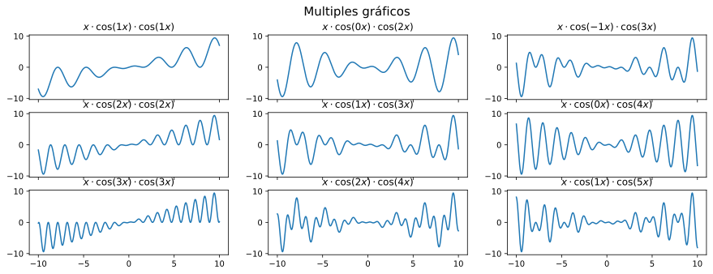
    


Podemos mejorar este tipo de gráfico. 

Añadiremos lo siguiente:

 - Margen vertical entre gráficos. Vemos que los titulos se solapan con los ejes de los gráficos superiores en la fila ii=1 y ii=2 [[Gridspec](https://matplotlib.org/3.1.1/api/_as_gen/matplotlib.gridspec.GridSpec.html#matplotlib.gridspec.GridSpec)]
   
   
    Esto se puede introducir mendiante 'gridspec_kw' cuando llamamos a plt.subplots(). Es una variable de entrada que se pasará después como tipo **kwargs**. Por ello, se introduce en un diccionario. El valor que nos interesa es 'hspace', la fracción de altura que se dedica a los márgenes verticales (height space).
    
- Añadimos el título también como label.


    Para hacer esto se incluye 'label' en la llamada al plot y después se utiliza 'ax[ii, jj].legend()'.
    
- Añadimos diferentes colores a cada plot.

    
    Esto lo hacemos mediante el módulo random de la librería numpy, el método random_samples para ser exactos. Utilizaremos este método para conseguir un ndarray de 3 elementos entre 0 y 1, que viene a ser como se define un color en el espacio RGB.


```python
# GRÁFICO
# > Creamos la figura y los ejes
#                      (nfilas, ncolumnas, tamaño, ejes compartidos X,Y opción de proporciones de la cuadrícula que se usará)
fig, ax = plt.subplots(3,3, figsize=(15,5), sharex = True, sharey=True, gridspec_kw={'hspace':0.4, 'wspace':0.2})
# Imprimimos el tipo de cada objeto, para saber con que estamos trabajando
#print(type(fig), type(ax))
# Esto nos da '<class 'matplotlib.figure.Figure'> <class 'numpy.ndarray'>'

# Ploteamos cada par X, data_dict[ii, jj]['data']
for ii in range(3):
    for jj in range(3):
        ax[ii, jj].plot(X,data_dict[ii,jj]['data'], label = data_dict[ii,jj]['text'], color = np.random.random_sample(3))
        ax[ii, jj].set_title(data_dict[ii, jj]['text'])
        # Añadimos leyenda en el subplot
        ax[ii, jj].legend(loc='lower center', fontsize=8, framealpha=0)

plt.suptitle('Multiples gráficos', fontsize=15)
plt.show()
```


    
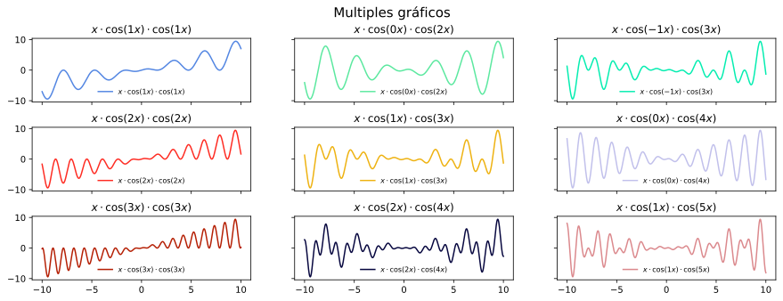
    


## Guardar gráficos


 - Usamos 'plt.savefig' para guardar las figuras. 
 
 
    Lo más habitual es hacer un gráfico y guardarlo al final.  
    Para esto se útiliza 'plt.savefig()', capturando lo ploteado anteriormente.

-  Podemos utilizar varios formatos de imagen.
    
    
    png,jpg,...  -> pixels
    pdf, svg,... -> vectoriales

Retomando el ejemplo del heatmap...


```python
# Generamos datos aleatorios
np.random.seed(1) # Estableciendo semilla para replicabilidad
matriz_de_datos = np.random.random_sample(size=(10,10))

# Plotear
plt.imshow(matriz_de_datos, vmax=1, vmin=0)

# Título
plt.title('Heatmap', fontsize=20, pad=10)

# Leyendas
plt.xlabel('Columnas', fontsize=15)
plt.ylabel('Filas', fontsize=15)
plt.xticks(np.array(range(10)), np.array(range(10))+1)
plt.yticks(np.array(range(10)), [chr(97+ii).upper() for ii in range(10)])
plt.ylim(9.5,-0.5)

# Barra de referencia de color y valores
plt.colorbar()

# Escribimos valor de una posición 
plt.text(0, 0, s=str(round(matriz_de_datos[0,0],1)), fontsize=8, ha='center', color='white', weight='bold')

# Guardamos la imagen
plt.savefig('IMG/heatmap.png')
plt.savefig('IMG/heatmap.pdf')
plt.close() # Si quitáramos esto jupyter seguiría mostrando el gráfico sin haber especificado un plt.show()
# además plt seguiría guardando la información introducida en plt y quizá al abrir el archivo el sistema operativo
#  nos daría algún error
```


## Pandas plot


**Ejemplo: wine reviews**


```python
import pandas as pd
```


```python
wine = pd.read_csv('Data/winemag-data-130k-v2.csv', index_col=0)
```


```python
wine.head(3)
```


<div>
<style scoped>
    .dataframe tbody tr th:only-of-type {
        vertical-align: middle;
    }

    .dataframe tbody tr th {
        vertical-align: top;
    }

    .dataframe thead th {
        text-align: right;
    }
</style>
<table border="1" class="dataframe">
  <thead>
    <tr style="text-align: right;">
      <th></th>
      <th>country</th>
      <th>description</th>
      <th>designation</th>
      <th>points</th>
      <th>price</th>
      <th>province</th>
      <th>region_1</th>
      <th>region_2</th>
      <th>taster_name</th>
      <th>taster_twitter_handle</th>
      <th>title</th>
      <th>variety</th>
      <th>winery</th>
    </tr>
  </thead>
  <tbody>
    <tr>
      <th>0</th>
      <td>Italy</td>
      <td>Aromas include tropical fruit, broom, brimston...</td>
      <td>Vulkà Bianco</td>
      <td>87</td>
      <td>NaN</td>
      <td>Sicily &amp; Sardinia</td>
      <td>Etna</td>
      <td>NaN</td>
      <td>Kerin O’Keefe</td>
      <td>@kerinokeefe</td>
      <td>Nicosia 2013 Vulkà Bianco  (Etna)</td>
      <td>White Blend</td>
      <td>Nicosia</td>
    </tr>
    <tr>
      <th>1</th>
      <td>Portugal</td>
      <td>This is ripe and fruity, a wine that is smooth...</td>
      <td>Avidagos</td>
      <td>87</td>
      <td>15.0</td>
      <td>Douro</td>
      <td>NaN</td>
      <td>NaN</td>
      <td>Roger Voss</td>
      <td>@vossroger</td>
      <td>Quinta dos Avidagos 2011 Avidagos Red (Douro)</td>
      <td>Portuguese Red</td>
      <td>Quinta dos Avidagos</td>
    </tr>
    <tr>
      <th>2</th>
      <td>US</td>
      <td>Tart and snappy, the flavors of lime flesh and...</td>
      <td>NaN</td>
      <td>87</td>
      <td>14.0</td>
      <td>Oregon</td>
      <td>Willamette Valley</td>
      <td>Willamette Valley</td>
      <td>Paul Gregutt</td>
      <td>@paulgwine</td>
      <td>Rainstorm 2013 Pinot Gris (Willamette Valley)</td>
      <td>Pinot Gris</td>
      <td>Rainstorm</td>
    </tr>
  </tbody>
</table>
</div>


```python
wine[['points', 'price']].info()
```

    <class 'pandas.core.frame.DataFrame'>
    Int64Index: 129971 entries, 0 to 129970
    Data columns (total 2 columns):
     #   Column  Non-Null Count   Dtype  
    ---  ------  --------------   -----  
     0   points  129971 non-null  int64  
     1   price   120975 non-null  float64
    dtypes: float64(1), int64(1)
    memory usage: 3.0 MB
    


## Pandas y matplotlib: pandas.plot


```python
# Generamos otro pandas con las columnas de interés, puntuación y precio de los vinos
puntuacion =  wine[['country','points', 'price']].dropna(how='any', axis=0)
```

**Primer ejemplo: scatter plot**


```python
# Utilizamos la llamada a la clase plot de pandas
puntuacion.plot(kind='scatter', x='points', y='price', alpha=0.2)
# Alternativamente podríamos haber usado el método .scatter() directamente 
#   > puntuacion.plot.scatter(x='points', y='price', alpha=0.2)
plt.title('Precio y puntuación de vinos')
plt.ylabel('Precio ($)')
plt.xlabel('Puntuación')
plt.show()
```


    

    


¿Qué destacarías del gráfico? 

¿Qué información aporta acerca de la asociación entre el precio y la puntuación dentro de la muestra que ofrece el dataset?

---

Ahora examinaremos las distribuciones de estas dos variables, cada una por su lado.

Esto nos sirve como ejemplo de como el método de ***pandas*** nos **permite combinar varios gráficos
 usando *plt.subplots***.


```python
# Creamos figura 
fig, ax = plt.subplots(2, figsize=(10,5), gridspec_kw = {'hspace': 0.5, 'top': 0.85})

# Histograma con pandas, sobre ejes de subplots
puntuacion.hist(column='points', width = 0.5, bins = 100, grid = False, ax = ax[0]) 
puntuacion.hist(column='price', width = 3, bins = 1000, grid = False, ax = ax[1])
# la variable 'ax' es un **kwarg del método .hist()

# Establecer límites de valores en eje horizontal
ax[0].set_xlim(70,100)
ax[1].set_xlim(0,500)

# Establecer título
ax[0].set_title('Puntuación')
ax[1].set_title('Precio')
# Establecer eje vertical
for ii in range(2):
    ax[ii].set_ylabel('Número de vinos', fontsize=9)

# Añadimos título
plt.suptitle('Número de vinos por Puntuación y Precio')

# Mostramos el gráfico
plt.show()

```


    
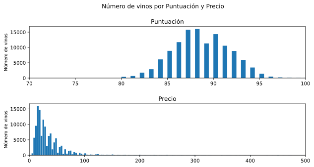
    


¿Cómo podemos hacer que en el eje horizontal se muestre la frecuencia relativa de elementos, en este caso de vinos?

Podemos mostrar el número de vinos para el top 10.


```python
# Parámetros
# > Número de paises a considerar en el ranking
n_top  = 10
# Usamos en este caso métodos asociados a Series
# > Semilla para definir colores aleatorios pero replicables 
np.random.seed(10)
# > Usamos *value_counts()* para obtener el número de entradas por pais y lo mostramos
puntuacion['country'].value_counts().iloc[:n_top].plot.bar(color=np.random.random_sample((n_top,3)), width=0.75 )

plt.title(f'Número de vinos para los {n_top} paises con más vinos')
plt.show()
```


    
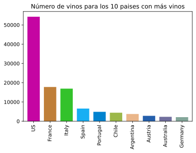
    


```python
# Parámetros
# > Número de paises a considerar en el ranking
n_top  = 10
# > Se puede hacer mediante pandas:
 # a) agrupar por país y contar instancias
 # b) ordenar filas/paises de mayor a menor y seleccionar 'precio'
 # c) seleccionar los primeros *n_top* paises y mostrar el gráfico
 # d) usar método de pandas como 'plotter'    
# (a)                                   (b)                                                 (c)     (d)                        
puntuacion.groupby(by='country').count().sort_values(by='price', ascending=False)[['price']].iloc[:n_top].plot.bar(legend=False, width=0.75, color='darkred')  
# Añadir el color a cada barra no es tan sencillo como antes

# > Título
plt.title(f'Número de vinos para los {n_top} paises con más vinos')
plt.xlabel('')
# > Mostrar gráfico
plt.show()
```


    
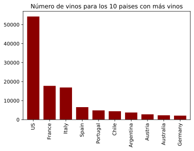
    


Podemos vovler a la relación entre puntuación y precio, estudiando la transformada logarítmica del precio como una nueva variable.


```python
# Creamos nueva columna en el pandas
puntuacion['price_log'] = np.log(puntuacion['price'])
```


```python
# Hacemos el gráfico en cuestion
puntuacion.plot(kind='scatter', x='points', y='price_log', alpha=0.05)
# Alternativamente podríamos haber usado 
#   > puntuacion.plot.scatter(x='points', y='price', alpha=0.2)
plt.title('Logaritmo natural de Precio y puntuación de vinos')
plt.ylabel('ln(Precio, $)')
plt.xlabel('Puntuación')
plt.show()
```


    

    


```python
def reg_1D(Y, X):
    # Coeficientes de regresión de mínimo MSE (error cuadrático medio) con una variable independiente
    beta_1 = ((X-X.mean()) * (Y-Y.mean())).sum() / ((X -X.mean())**2).sum()
    beta_0 = Y.mean() - beta_1 * X.mean()
    
    return(beta_0, beta_1)
```


```python
b0, b1 = reg_1D(puntuacion['price_log'], puntuacion['points'])
```


```python
puntuacion.plot(kind='scatter', x='points', y='price_log', alpha=0.05)
plt.plot( [80,100], [b0+b1*80, b0+b1*100], color='red')
# Alternativamente podríamos haber usado 
#   > puntuacion.plot.scatter(x='points', y='price', alpha=0.2)


plt.title('Precio y puntuación de vinos')
plt.ylabel('Precio ($)')
plt.xlabel('Puntuación')
plt.show()
```


    

    


Habría que analizar los residuos, $\hat{\epsilon}_i=(y_i-\hat{y_i})$, que son las estimaciones de los errores de regresión. Estos deben cumplir las hipótesis de normalidad, varianza constante, aleatoriedad e independencia...  Esto lo estareís o lo veréis con Norberto.

[Más documentación pandas plot](https://pandas.pydata.org/pandas-docs/stable/reference/api/pandas.DataFrame.plot.html)

---

## Crear GIFs animados


¡Visualizaremos una onda!

Creación de datos... 

                           ... que vienen a ser las imagenes que uniremos


```python
from pathlib import Path # Una buena librería para trabajar con direcciones
import math


def seno(x, t, fase_rad=0, longitud_onda=1.0):
    '''
    Función para valores de onda en instante *t*, para fase *fase_rad* en radianes y longitud de onda *longitud_onda* en metros
    '''
    return(np.sin( 1*t - 2*(math.pi/longitud_onda)*x + fase_rad))


def crear_imagenes_onda(path, xmin=0, xmax=1, n_puntos=50, n_instantes=25, longitud_onda=1, **kwargs):
    '''
    Función para crear los valores de una onda senosoidal en el espacio dados:
     
     *x* será un numpy array con los valores discretos del espacio en metros, con rango de
       *xmin* valor mínimo
       *xmax* valor máximo
       *n_puntos* cantidad de puntos
     *longitud_onda* longitud de onda (m) y tiempo (u.)

    ''' 
    
    # > Creamos el vector de tiempo
    x = np.linspace(xmin, xmax, n_puntos,  endpoint=True) # endpoint incluye el último punto
    
    # > Usamos 'enumerate' para obtener índice, instante
    for ii, t in enumerate(np.linspace(0, 2*math.pi, n_instantes)):
        
        # > Mostramos la onda para cada instante
        plt.plot(x, seno(x, t, longitud_onda=longitud_onda), **kwargs)
        # > Título
        plt.title(fr'Onda  ($\lambda =$ {longitud_onda} m)')
        plt.xlabel('Espacio (m)')
        plt.ylim(-1,1)
        plt.savefig(path/ f'imagen_{ii}.png')
        plt.close()
    
    print('Creadas las imagenes\n')
```

Creación de GIF.. 

                           ... para unir las imagenes


```python
import imageio
from pathlib import Path
def imgs2gif(path_gif_input, duration = 0.5):
    
    '''
    Función para crear gifs a partir de imagenes 'png' detro de un directorio
    
    *path_gif_input*               tipo 'pathlib.Path()' con directorio donde se encuentran las imagenes
    *param duration* (opcional)    con la duración, en segundos, de cada imagen.
    
    '''
    
    # Creamos instancia de clase Path
    path_gif_in =  path_gif_input
    
    # Creamos un diccionario para almacenar todas las imagenes de extensión 'png'
    # en la capeta especificada.
    files_dict = {}
    for ff in path_gif_in.iterdir(): # Iteramos sobre todos los elementos en el directorio *path_gif_in*
        if ff.is_file(): # Comprobamos que es un archivo
            if ff.suffix == ".png": # Comprobamos que tiene extension 'png'
                if 'imagen' in ff.stem: # Comprobamos que su nombre contiene 'imagen' 
                    files_dict[int(ff.stem.split("_")[1])] = ff
                
    # Creamos una lista con instancias de imagenes ordenadas por la llave del diccionario creado previamente
    images = [imageio.imread(files_dict[key]) for key in sorted(files_dict.keys())]
    
    # Guardar en gif con *duracion* segundos
    # Notése que el valor de la duración de cada imagen es el que nos dará la frecuencia de la onda...
    imageio.mimsave(path_gif_in/'animacion.gif', images, **{'duration': duration})
    
    print('Creada la animación GIF\n')
```

Código principal...


```python
# Creamos un objeto Path haciendo referencia a la carpera IMG dentro de la carpeta donde está este notebook
directorio = (Path.cwd() / 'IMG')

# Si no existe la creamos, pero si existe ignoramos errores
directorio.mkdir(exist_ok=True)

# Creamos las imagenes mediante nuestra función *crear_onda*
crear_imagenes_onda(path = directorio, n_puntos=50, n_instantes=25, longitud_onda=0.5, color='red')

# Crear GIF
imgs2gif(Path.cwd() / 'IMG', duration = 1/25)
```

    Creadas las imagenes
    
    Creada la animación GIF
    
    

**¿Cómo recrearías el punto de este GIF de Wikipedia?**


El punto es un plt.scatter() con posición diferente en cada instante...

---
## Graficos interactivos con IPython

- Utilizamos *widget* e [*interact*](https://ipywidgets.readthedocs.io/en/stable/examples/Using%20Interact.html) de la librería IPython


```python
from __future__ import print_function
from ipywidgets import interact, interactive, fixed, interact_manual
import ipywidgets as widgets
```


```python
@interact_manual
def plot(index=3, colores_diferentes=True, titulo=fixed('Multiples gráficos')):
    '''
    Función para ejemplo de interact de IPython
    
    las variables opcionales introducidas se vuelven variables automáticamente, 
    con un controlador dependiendo del tipo de variable (str, int, float)
    
    '''
    
    
    # > Creamos los puntos del eje de abscisa
    X=np.linspace(-10,10,1000)

    # > Creación de datos para el eje de ordenada (9 listas, una para cada subplot, y cada una de 100 elementos como X)

    # >> Usamos diccionarios
    data_dict = {}

    # >> Creamos los puntos del eje de ordenadas mediante ecuaciones del coseno.
    #     Para esto hacemos dos bucles anidados, de tres cada uno para obtener 9 valores.
    for ii in range(3):
        for jj in range(3):

            data_dict[ii, jj] = {'data':  X*np.cos((ii-jj+index)*X)*np.cos((ii+jj+index)*X), # Añadimos datos,  
                                 'text': fr'$x\cdot\cos({ii-jj+index}x)\cdot\cos({ii+jj+index}x)$' } 
                                           # ecuación en formato text usando notación de LaTeX
                                           # (usamos f para formato y r para formato LaTeX)


    # Creamos la figura y los ejes
    fig, ax = plt.subplots(3,3, figsize=(15,5), sharex = True, sharey=True, gridspec_kw={'hspace':0.4, 'wspace':0.2})

    # Ploteamos cada par X, data_dict[ii, jj]['data']
    # Antes fijamos la semilla
    np.random.seed(1) # ¿Qué pasa si no la fijamos?
    for ii in range(3):
        for jj in range(3):
            color = 'grey' # Color por defecto
            if colores_diferentes: color = np.random.random_sample(3) # Color aleatorio si *colores_diferetes* es True
            
            # Plotramos sobre el eje ii, jj
            ax[ii, jj].plot(X,data_dict[ii,jj]['data'], label = data_dict[ii,jj]['text'], color = color )
            # Introducimos título
            ax[ii, jj].set_title(data_dict[ii, jj]['text'])
            # Añadimos leyenda en el subplot
            ax[ii, jj].legend(loc='lower center', fontsize=8, framealpha=0)

    plt.suptitle(titulo, fontsize=15)
    plt.show()
```


    interactive(children=(IntSlider(value=3, description='index', max=9, min=-3), Checkbox(value=True, description…


---
# Leer varios ficheros y visualizar encuestas


```python
# Aquí incluiremos el código de las encuestas

# Pensad en las subtareas que queremos acometer (leer los ficheros, cargarlos como pandas (son xlsx, que comando uso¿?,
 #                  ))
```


```python

```

---
# ¿Qué técnicas usarás para explorar tu siguiente dataset?

- Tipo de gráfico <-> naturaleza de datos que queremos entender/analizar.
- Matplotlib.pyplot
- Pandas plot
- Gráficos interactivos (seleccionar columnas de pandas, etc)
- GIFs para datos que evolucionan en el tiempo...
