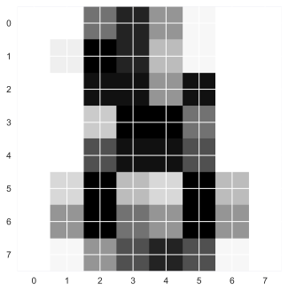
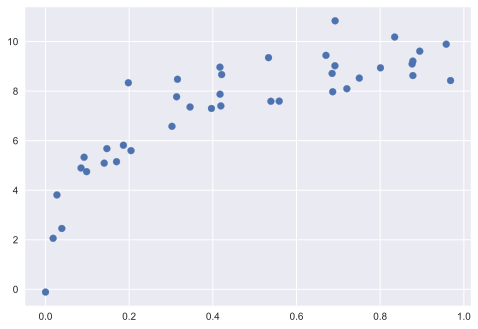
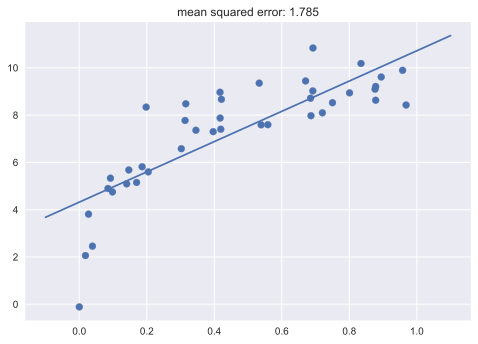
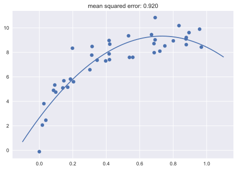
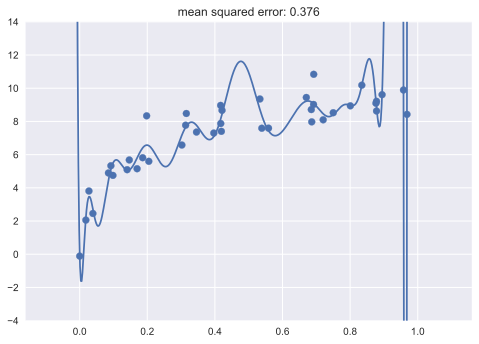
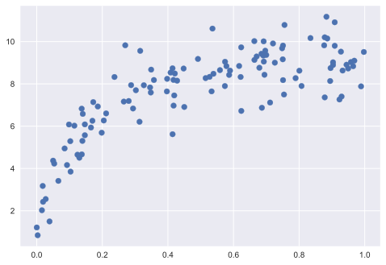
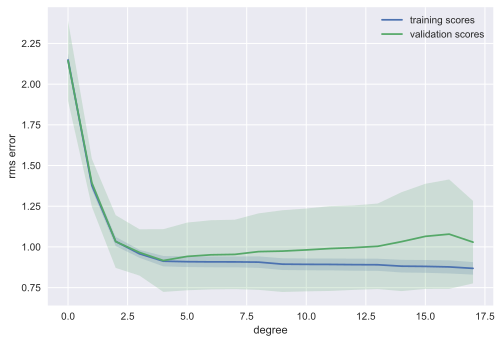
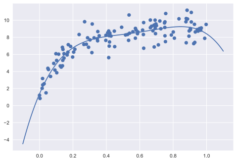

Una pieza muy importante del machine learning es la **validación del modelo**, esto es, determinar como de bien generalizará nuestro modelo en datos no etiquetados que todavía no ha visto.

Para los ejemplos, ahora vamos a trabajar con unos nuevos datos.


```python
import numpy as np
import matplotlib.pyplot as plt
plt.style.use('seaborn')
```


```python
from sklearn.datasets import load_digits

digits = load_digits()
X = digits.data
y = digits.target

print("X shape:", X.shape)
print("y shape:", y.shape)
```

    X shape: (1797, 64)
    y shape: (1797,)
    


```python
plt.imshow(X[-1, :].reshape(8, 8));
```


    

    


Vamos a ajustar un KNN a nuestros datos:


```python
from sklearn.neighbors import KNeighborsClassifier

knn = KNeighborsClassifier(n_neighbors=1)
knn.fit(X, y)
```


    KNeighborsClassifier(n_neighbors=1)


Ahora usamos el clasificador que hemos estimado para hacer predicciones:


```python
y_pred = knn.predict(X)
```

Para terminar, comprobamos la precisión de nuestro clasificador:


```python
print(f"{np.sum(y == y_pred)} / {len(y)} correct")
```

    1797 / 1797 correct
    

Al parecer, nuestro clasificador es perfecto. 

**Pregunta: ¿Que hemos hecho mal aquí?**

## Conjunto de validación

En el anterior ejemplo hemos cometido el error de evaluar nuestro modelo en el mismo conjunto de datos que hemos utilizado para entrenar. **Esto es una mala idea.** Si optimizamos nuestro modelo de estimación de está manera, acabaremos teniendo un problema de **over-fiting**.

Un método mejor para evaluar nuestro modelo es utilizar para ello un conjunto de datos separado en el que el modelo no haya entrenado.


```python
from sklearn.model_selection import train_test_split

X_train, X_test, y_train, y_test = train_test_split(X, y, random_state=0)
X_train.shape, X_test.shape
```


    ((1347, 64), (450, 64))


Ahora, vamos a entrenar en el conjunto de entrenamiento y evaluar el modelo en el conjunto de test:


```python
knn = KNeighborsClassifier(n_neighbors=1)
knn.fit(X_train, y_train)
y_pred = knn.predict(X_test)
print(f"{np.sum(y_test == y_pred)} / {len(y_test)} corret")
```

    446 / 450 corret
    

Esto nos da una imágen más realista de como lo está haciendo nuestro modelo.

Al comparar el número de coincidencias con el número total de instancias estamos calculando la métrica conocida como **exactitud** o **accuracy**. Podemos calcularla de otra forma:


```python
from sklearn.metrics import accuracy_score

accuracy_score(y_test, y_pred)
```


    0.9911111111111112


```python
knn.score(X_test, y_test)
```


    0.9911111111111112


Podemos estudiar como cambia la **accuracy** al cambiar el valor del **hiperparametro** de nuestro modelo:


```python
for n_neighbors in [1, 5, 10, 20, 30]:
    knn = KNeighborsClassifier(n_neighbors)
    knn.fit(X_train, y_train)
    print(n_neighbors, knn.score(X_test, y_test))
```

    1 0.9911111111111112
    5 0.98
    10 0.9755555555555555
    20 0.9644444444444444
    30 0.9555555555555556
    

Podemos observar que al parecer, elegir un número pequeño de vecinos es la mejor opción.

## Cross-Validation

El problema de tener que guardar un subconjunto de nuestro conjunto de datos para hacer la evaluación es que a veces nos podemos quedar sin datos suficientes para poder entrenar un algoritmo que desempeñe bien su tarea.

La **validación cruzada** o **cross-validation** es un es una técnica utilizada para evaluar los resultados de un análisis estadístico y garantizar que son independientes de la partición entre datos de entrenamiento y prueba. Consiste en repetir y calcular la media aritmética obtenida de las medidas de evaluación sobre diferentes particiones.


```python
X1, X2, y1, y2 = train_test_split(X, y, test_size=0.5, random_state=0)
X1.shape, X2.shape
```


    ((898, 64), (899, 64))


```python
print(KNeighborsClassifier(1).fit(X2, y2).score(X1, y1))
print(KNeighborsClassifier(1).fit(X1, y1).score(X2, y2))
```

    0.9832962138084632
    0.982202447163515
    


```python
print((KNeighborsClassifier(1).fit(X2, y2).score(X1, y1) + KNeighborsClassifier(1).fit(X1, y1).score(X2, y2)) / 2)
```

    0.9827493304859891
    

En la API de scikit-learn tenemos implementado un método para hacer esto mucho más rápido:


```python
from sklearn.model_selection import cross_val_score

cv = cross_val_score(KNeighborsClassifier(n_neighbors=1), X, y, cv=2)
print(cv)
print(cv.mean())
```

    [0.96329255 0.95991091]
    0.9616017302075308
    

## K-fold Cross-Validation

En los anteriores ejemplos, hemos usado un 2-fold cross-validation. Esto es un ejemplo concreto de K-fold cross-validation. Con esta técnica, creamos K particiones independientes del conjunto de datos principal, y para cada partición, entrenamos en el resto de dataset y luego evaluamos nuestro modelo en la partición que hemos guardado. Así, tendremos K métricas, una para cada fold. El número de particiones, K, lo especificamos con el parámetro `cv`.


```python
cross_val_score(KNeighborsClassifier(1), X, y, cv=10)
```


    array([0.93333333, 0.99444444, 0.97222222, 0.97222222, 0.96666667,
           0.98333333, 0.99444444, 0.98882682, 0.97765363, 0.96648045])


Con esto, conseguimos una mejor imágen de como funciona nuestro modelo.

## Overfitting, Underfitting y selección del modelo

Elegir el mejor modelo posible es una cuestión de lo más importante en el campo del aprendizaje automático. Pero esta tarea puede ser complicada.

Hay una serie de preguntas que tenemos que hacernos si nuestro modelo no obtiene buenos resultado:

* ¿Tenemos que usar un modelo más complicado o mas sencillo?
* ¿Deberíamos de usar más características en nuestro estimador?
* ¿Necesitamos más datos para lograr mejores estimadores?

No hay un resultado correcto para estas preguntas. A veces, nos vamos a encontrat con que un modelo más complicado va a obtener todavía peores resultados. Otras veces, el hecho de conseguir más instancias para aprender tampoco nos va ayudar. El hecho de ser capazes de determinar que pasos nos van a ayudar a mejorar nuestro modelo es algo fundamental.

### Bias-Variance Tradeoff

Vamos a analizar este problema visualmente con un ejemplo de regresión.


```python
def test_func(x, err=0.5):
    y = 10 - 1. / (x + 0.1)
    if err > 0:
        y = np.random.normal(y, err)
    return y
```


```python
def make_data(N=40, error=1.0, random_seed=1):
    # randomly sample the data
    np.random.seed(1)
    X = np.random.random(N)[:, np.newaxis]
    y = test_func(X.ravel(), error)
    
    return X, y
```


```python
X, y = make_data(40, error=1)
plt.scatter(X.ravel(), y);
```


    

    


Vamos a usar una regresión lineal para estimar un modelo a partir de los datos.


```python
X_test = np.linspace(-0.1, 1.1, 500)[:, None]

from sklearn.linear_model import LinearRegression
from sklearn.metrics import mean_squared_error
model = LinearRegression()
model.fit(X, y)
y_test = model.predict(X_test)

plt.scatter(X.ravel(), y)
plt.plot(X_test.ravel(), y_test)
plt.title(f"mean squared error: {mean_squared_error(model.predict(X), y):.3f}");
```


    

    


Hemos ajustado una linea recta a los datos, pero está claro que este modelo no es muy buena opción por que no representa la relación entre los diferentes puntos muy bien. Tenemos un error de **bias** o un problema de **underfitting**.

Vamos a intentar mejorar el resultado utilizando modelos más complicados. Para ello, vamos a usar el método de `PolynomialFeatures` que nos da la API de scikit-learn para preprocesar los datos y así crear nuevas caracteristicas con combinaciones polinomiales de las características originales. Usando el método `make_pipeline` lo juntamos con la regresión.


```python
from sklearn.preprocessing import PolynomialFeatures
from sklearn.linear_model import LinearRegression
from sklearn.pipeline import make_pipeline

def PolynomialRegression(degree=2, **kwargs):
    return make_pipeline(PolynomialFeatures(degree), LinearRegression(**kwargs))
```


```python
model = PolynomialRegression(2)
model.fit(X, y)
y_test = model.predict(X_test)

plt.scatter(X.ravel(), y)
plt.plot(X_test.ravel(), y_test)
plt.title(f"mean squared error: {mean_squared_error(model.predict(X), y):.3f}");
```


    

    


Este modelo ha conseguido reducir el error cuadrático medio y se ajusta mejor a los datos. ¿Que sucede si añadimos componentes con mayor grado a nuestra regresiñon polinómica? 


```python
model = PolynomialRegression(30)
model.fit(X, y)
y_test = model.predict(X_test)

plt.scatter(X.ravel(), y)
plt.plot(X_test.ravel(), y_test)
plt.title(f"mean squared error: {mean_squared_error(model.predict(X), y):.3f}")
plt.ylim(-4, 14);
```


    

    


Cuando hemos aumentado el grado de la regresión polinómica, vemos que llegamos a un punto en el que el modelo que inferimos no refleja nada bien la distribución subyacente de nuestors datos. Además, nuestro modelo es mas sensitivo al ruido que tenemos en nuestro conjunto de entrenamiento. Por eso decimos que nuestro modelo tiene un problema de **overfitting**.

### Detectar problemas de over-fitting con las curvas de validación

Calcular el error solamente en los datos de entrenamiento no es suficiente. Por lo tanto, vamos a usar la validación cruzada para entender mejor como de bien está funcionando nuestro modelo.

Vamos a usar las curvas de validación y un dataset más grande para ver las cosas con más claridad:


```python
X, y = make_data(120, error=1.0)
plt.scatter(X, y);
```


    

    


```python
from sklearn.model_selection import validation_curve

def rms_error(model, X, y):
    y_pred = model.predict(X)
    return np.sqrt(np.mean((y - y_pred) ** 2))

degree = np.arange(0, 18)
val_train, val_test = validation_curve(PolynomialRegression(), X, y,
                                       param_name='polynomialfeatures__degree', 
                                       param_range=degree,
                                       cv=7, scoring=rms_error)
```


```python
def plot_with_err(x, data, **kwargs):
    mu, std = data.mean(1), data.std(1)
    lines = plt.plot(x, mu, '-', **kwargs)
    plt.fill_between(x, mu - std, mu + std, edgecolor='none',
                     facecolor=lines[0].get_color(), alpha=0.2)

plot_with_err(degree, val_train, label='training scores')
plot_with_err(degree, val_test, label='validation scores')
plt.xlabel('degree'); plt.ylabel('rms error')
plt.legend();
```


    

    


Vamos a fijarnos en la tendencía que se puede observar en el gráfico:

1. Cuando utilizamos modelos muy poco complejos, vemos que tanto el error en conjunto de entrenamiento como en el validación son bastante altos y similares. Esto nos indica que tenemos un problema de **underfitting**: el modelo no tiene complejidad suficiento como para representar los datos debidamente (**high-bias**).

2. A medida que la complejidad del modelo va creciendo, vemos que los errores de ambos conjunto disminuyen. Esto nos indica que el modelo se esta ajustando a los datos.

3. Por último, vemos que hay un punto en el que el error de validación deja de decrecer por más que la complejidad del modelo sigue aumentando, incluso aumenta un poco. Esto nos indica que empezamos a tener un problema de **overfitting** (o **high-variance**). El error de entrenamiento sigue mejorando pero esto se debe a que un modelo más complicado puede modelar mejor el ruido del conjunto de entrenamiento.

El mejor modelo según el gráfico de arriba, sería con un grado polinomial de 4:


```python
model = PolynomialRegression(4).fit(X, y)
plt.scatter(X, y)
plt.plot(X_test, model.predict(X_test));
```


    

    


## Búsqueda de hiperparámetros

Los hiperparámetros de un modelo de aprendizaje automático son parámetros que se utilizan para controlar el proceso de aprendizaje. Por lo tanto, estos parámetros no se especifican antes de ajustar el modelo a los datos. Por ejemplo, en el algoritmo KNN, el número de vecinos es el hiperparámetro más importante, además de la métrica de distancia. 


```python
from sklearn.datasets import load_digits
from sklearn.model_selection import GridSearchCV
from sklearn.neighbors import KNeighborsClassifier

digits = load_digits()
X = digits.data
y = digits.target
X_train, X_test, y_train, y_test = train_test_split(X, y, random_state=0)

knn = KNeighborsClassifier()

param_grid = {'n_neighbors': [1, 5, 10, 20], 'metric': ('euclidean', 'manhattan', 'chebyshev')}

search = GridSearchCV(knn, param_grid, cv=5).fit(X_train, y_train)
```


```python
search.best_estimator_
```


    KNeighborsClassifier(metric='euclidean')


```python
search.best_estimator_.score(X_test, y_test)
```


    0.98


```python
search.best_score_
```


    0.9858846206801598


```python
import pandas as pd

pd.DataFrame(search.cv_results_)
```


<div>
<style scoped>
    .dataframe tbody tr th:only-of-type {
        vertical-align: middle;
    }

    .dataframe tbody tr th {
        vertical-align: top;
    }

    .dataframe thead th {
        text-align: right;
    }
</style>
<table border="1" class="dataframe">
  <thead>
    <tr style="text-align: right;">
      <th></th>
      <th>mean_fit_time</th>
      <th>std_fit_time</th>
      <th>mean_score_time</th>
      <th>std_score_time</th>
      <th>param_metric</th>
      <th>param_n_neighbors</th>
      <th>params</th>
      <th>split0_test_score</th>
      <th>split1_test_score</th>
      <th>split2_test_score</th>
      <th>split3_test_score</th>
      <th>split4_test_score</th>
      <th>mean_test_score</th>
      <th>std_test_score</th>
      <th>rank_test_score</th>
    </tr>
  </thead>
  <tbody>
    <tr>
      <th>0</th>
      <td>0.014536</td>
      <td>0.002122</td>
      <td>0.040941</td>
      <td>0.002162</td>
      <td>euclidean</td>
      <td>1</td>
      <td>{'metric': 'euclidean', 'n_neighbors': 1}</td>
      <td>0.970370</td>
      <td>0.985185</td>
      <td>0.988848</td>
      <td>0.988848</td>
      <td>0.988848</td>
      <td>0.984420</td>
      <td>0.007166</td>
      <td>2</td>
    </tr>
    <tr>
      <th>1</th>
      <td>0.012997</td>
      <td>0.001095</td>
      <td>0.039627</td>
      <td>0.002615</td>
      <td>euclidean</td>
      <td>5</td>
      <td>{'metric': 'euclidean', 'n_neighbors': 5}</td>
      <td>0.988889</td>
      <td>0.996296</td>
      <td>0.973978</td>
      <td>0.985130</td>
      <td>0.985130</td>
      <td>0.985885</td>
      <td>0.007216</td>
      <td>1</td>
    </tr>
    <tr>
      <th>2</th>
      <td>0.011402</td>
      <td>0.000490</td>
      <td>0.037456</td>
      <td>0.001205</td>
      <td>euclidean</td>
      <td>10</td>
      <td>{'metric': 'euclidean', 'n_neighbors': 10}</td>
      <td>0.977778</td>
      <td>0.981481</td>
      <td>0.973978</td>
      <td>0.977695</td>
      <td>0.985130</td>
      <td>0.979212</td>
      <td>0.003793</td>
      <td>5</td>
    </tr>
    <tr>
      <th>3</th>
      <td>0.011789</td>
      <td>0.000392</td>
      <td>0.038464</td>
      <td>0.000770</td>
      <td>euclidean</td>
      <td>20</td>
      <td>{'metric': 'euclidean', 'n_neighbors': 20}</td>
      <td>0.962963</td>
      <td>0.970370</td>
      <td>0.962825</td>
      <td>0.970260</td>
      <td>0.970260</td>
      <td>0.967336</td>
      <td>0.003627</td>
      <td>10</td>
    </tr>
    <tr>
      <th>4</th>
      <td>0.012969</td>
      <td>0.000673</td>
      <td>0.031344</td>
      <td>0.001917</td>
      <td>manhattan</td>
      <td>1</td>
      <td>{'metric': 'manhattan', 'n_neighbors': 1}</td>
      <td>0.977778</td>
      <td>0.977778</td>
      <td>0.973978</td>
      <td>0.981413</td>
      <td>0.977695</td>
      <td>0.977728</td>
      <td>0.002351</td>
      <td>7</td>
    </tr>
    <tr>
      <th>5</th>
      <td>0.012159</td>
      <td>0.000686</td>
      <td>0.032205</td>
      <td>0.000987</td>
      <td>manhattan</td>
      <td>5</td>
      <td>{'metric': 'manhattan', 'n_neighbors': 5}</td>
      <td>0.981481</td>
      <td>0.992593</td>
      <td>0.970260</td>
      <td>0.977695</td>
      <td>0.985130</td>
      <td>0.981432</td>
      <td>0.007443</td>
      <td>3</td>
    </tr>
    <tr>
      <th>6</th>
      <td>0.012794</td>
      <td>0.000391</td>
      <td>0.034054</td>
      <td>0.001001</td>
      <td>manhattan</td>
      <td>10</td>
      <td>{'metric': 'manhattan', 'n_neighbors': 10}</td>
      <td>0.962963</td>
      <td>0.977778</td>
      <td>0.962825</td>
      <td>0.970260</td>
      <td>0.977695</td>
      <td>0.970304</td>
      <td>0.006638</td>
      <td>8</td>
    </tr>
    <tr>
      <th>7</th>
      <td>0.012352</td>
      <td>0.000412</td>
      <td>0.034568</td>
      <td>0.001731</td>
      <td>manhattan</td>
      <td>20</td>
      <td>{'metric': 'manhattan', 'n_neighbors': 20}</td>
      <td>0.966667</td>
      <td>0.959259</td>
      <td>0.959108</td>
      <td>0.955390</td>
      <td>0.973978</td>
      <td>0.962880</td>
      <td>0.006647</td>
      <td>11</td>
    </tr>
    <tr>
      <th>8</th>
      <td>0.012436</td>
      <td>0.000589</td>
      <td>0.031812</td>
      <td>0.002274</td>
      <td>chebyshev</td>
      <td>1</td>
      <td>{'metric': 'chebyshev', 'n_neighbors': 1}</td>
      <td>0.970370</td>
      <td>0.977778</td>
      <td>0.973978</td>
      <td>0.988848</td>
      <td>0.985130</td>
      <td>0.979221</td>
      <td>0.006863</td>
      <td>4</td>
    </tr>
    <tr>
      <th>9</th>
      <td>0.012549</td>
      <td>0.000468</td>
      <td>0.034837</td>
      <td>0.000656</td>
      <td>chebyshev</td>
      <td>5</td>
      <td>{'metric': 'chebyshev', 'n_neighbors': 5}</td>
      <td>0.974074</td>
      <td>0.974074</td>
      <td>0.970260</td>
      <td>0.988848</td>
      <td>0.985130</td>
      <td>0.978477</td>
      <td>0.007185</td>
      <td>6</td>
    </tr>
    <tr>
      <th>10</th>
      <td>0.012615</td>
      <td>0.001945</td>
      <td>0.034643</td>
      <td>0.002801</td>
      <td>chebyshev</td>
      <td>10</td>
      <td>{'metric': 'chebyshev', 'n_neighbors': 10}</td>
      <td>0.959259</td>
      <td>0.974074</td>
      <td>0.966543</td>
      <td>0.966543</td>
      <td>0.981413</td>
      <td>0.969566</td>
      <td>0.007552</td>
      <td>9</td>
    </tr>
    <tr>
      <th>11</th>
      <td>0.013410</td>
      <td>0.002317</td>
      <td>0.039238</td>
      <td>0.002205</td>
      <td>chebyshev</td>
      <td>20</td>
      <td>{'metric': 'chebyshev', 'n_neighbors': 20}</td>
      <td>0.955556</td>
      <td>0.959259</td>
      <td>0.966543</td>
      <td>0.947955</td>
      <td>0.966543</td>
      <td>0.959171</td>
      <td>0.007036</td>
      <td>12</td>
    </tr>
  </tbody>
</table>
</div>


# Flow chart: Como elegir el Estimator

El siguiente [diagrama de flujo](http://scikit-learn.org/stable/tutorial/machine_learning_map/), creado por [Andreas Muller](https://github.com/amueller), nos da una visión general de que algoritmos podemos elegir en diferentes situaciones.


```python
from IPython.display import Image
Image("http://scikit-learn.org/dev/_static/ml_map.png")
```


    

    


